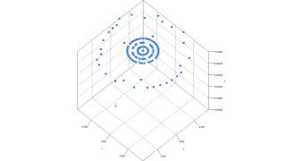

# Hack Hunterdon II
We built a low cost 3D scanner that maps small objects onto a 3D plane.

## Demo
Here is a GIF of our 3D scanner in action:

Here is a demo video of our 3D scanner plotting a water bottle onto a 3D plane.

